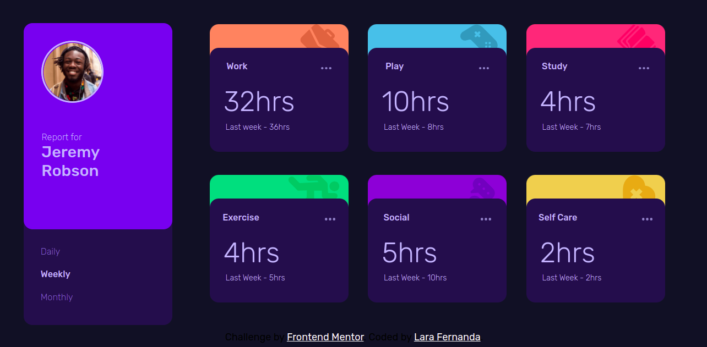

# Time Tracking Dashboard



# Tecnologias

<ul>
    <li>HTML</li>
    <li>Pré-processador Sass</li>
    <li>JavaScript</li>
</ul>

# Como executar

Clone o projeto em seu dispositivo e acesse a pasta do mesmo.

```
$ git clone 
$ cd
$ code .  (Abrir o Visual Studio Code)
```

# Projeto

Time Tracking Dashboard é um desafio da plataforma FrontendMentor, que tem o objetivo de treinar os conceitos de HTML, CSS, o pré processador Sass e, também a linguagem JavaScript.

# Autor

Lara Fernanda

# Licença

Este projeto está sob a licença MIT -


